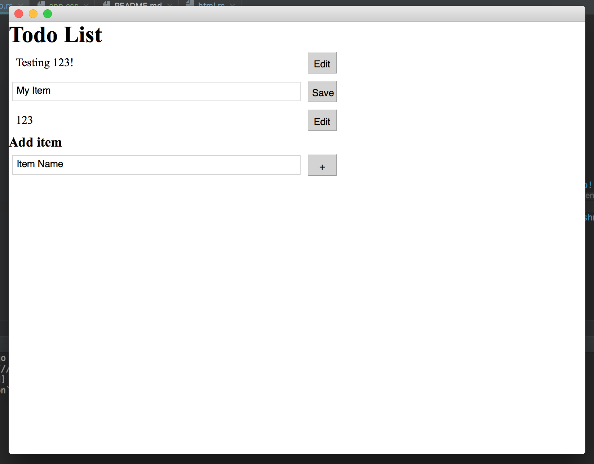

## Ion - An Oxidized Electron
Proof of concept for building native html/css/rust apps using servo. Ideally, this would be like electron, but with rust/servo instead of javascript/webkit

## Progress
This is one big massive hack, and will probably never be completed.

## Structure
See [app.rs](src/app.rs) for the meat of the application. You simply provide a render function that takes a state and produces an immutable dom tree.
Everything else is library code that does not need to be duplicated.

## Pictures:


To build:
Download my fork of servo, https://github.com/justinmichaud/servo to ../servo
On Mac, build as normal with cargo:
```
cargo run --release
```

On Fedora 27, I needed to use these env flags to get glutin to work. This seems to be some mesa bug, which should be fixed soon.
Also, for some reason, on Fedora a release build crashes with SIGILL
```
RUST_BACKTRACE=full
WAYLAND_DISPLAY=wayland-1
```

## TODO:
- Find a way to not mutilate servo's encapsulation
- Support embedding css with an element
- Add an html template macro
- Native file menu, open/save file dialog
- OpenGL support: Allow overlaying opengl content, maybe hook into window.present callback? Canvas integration would be nice.

To upgrade servo:
change cargo.toml, then `cp -r ../servo/resources . && cp ../servo/Cargo.lock . && cp ../servo/rust-toolchain .`
